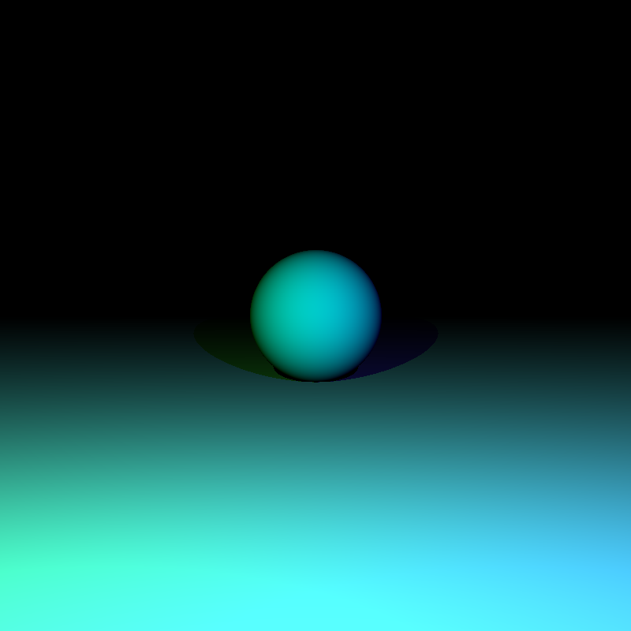

Rustracer
=========

This is a simplistic Raytracer written in Rust. The main goal is to write a simple and elegant Rust program. It's not efficient, it's not powerful, but the code should be pretty straightforward.

Currently, it handles the following :

- Simple objects (spheres, planes)
- Multiple light sources
- Shadows
- Reflection

I want to add some functionalities, like :

- Rotation
- Transparency
- Refraction

I also want to do some experiments with Path-Tracing and Photon-Mapping.

