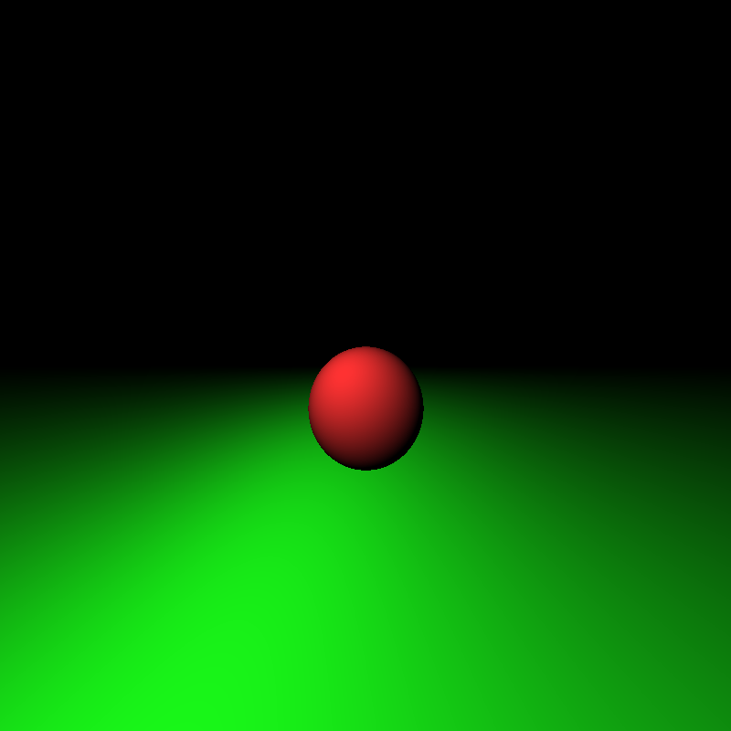

Rustracer
=========

This raytracer is basically the transcription in Rust of a short one I wrote a few years back in C. It's broken, non-efficient, poorly designed and not powerful. The main goal was to do some experiments with Rust, not to build the future of raycasting.

I'll try to make some improvements in the near future, but I don't understand the maths behind most of the papers concerning raycasting. If you want to help me, feel free to open an issue or make a pull-request.

